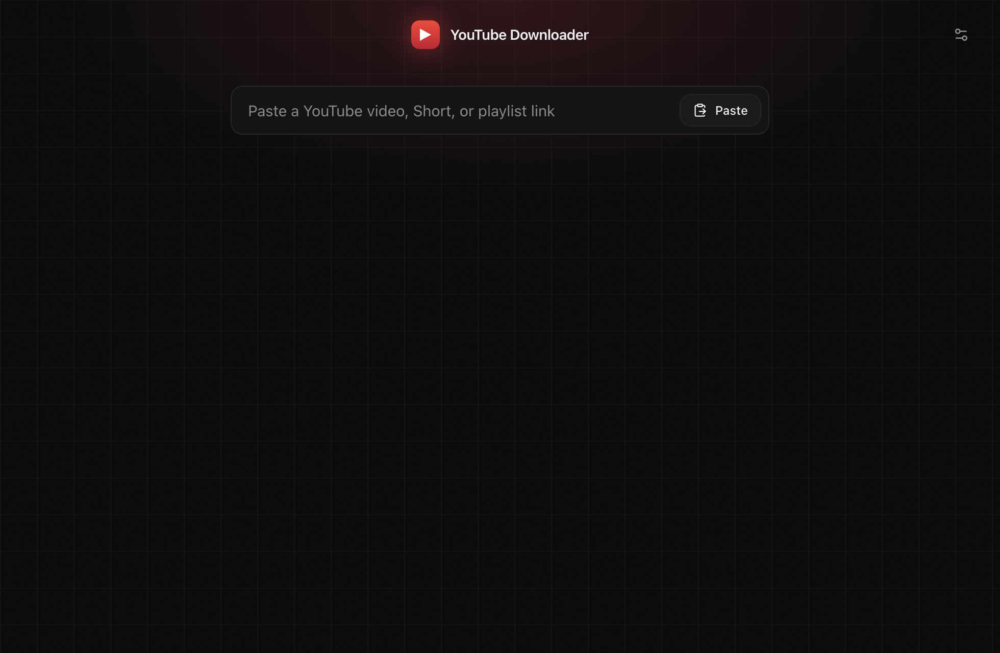
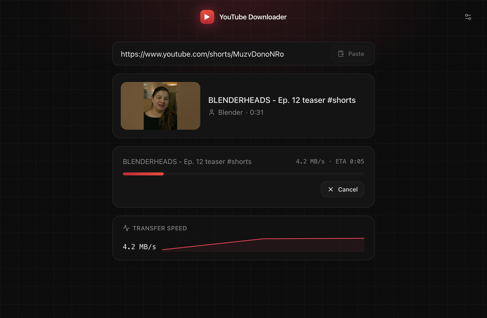
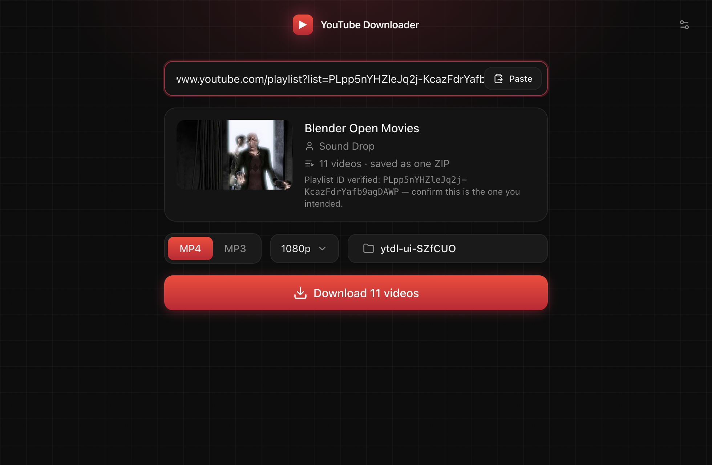
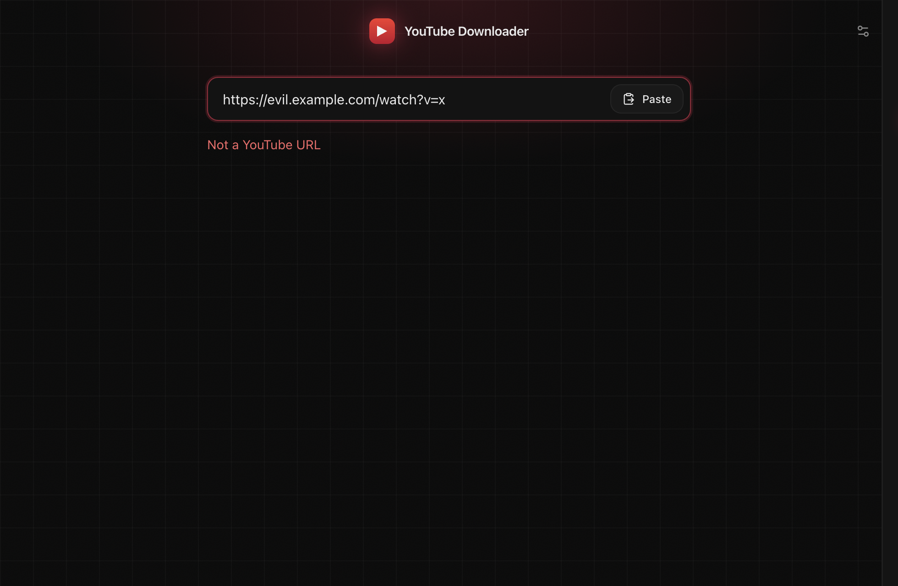

# YouTube Downloader

A fast, no-nonsense desktop app for saving YouTube videos, Shorts, and playlists you have the right to download — as MP4 or MP3.

---

## 📥 Download

### 🍎 macOS

**[⬇️ Download Latest for macOS (.dmg)](https://github.com/kaasyapv/youtube-downloader/releases/latest/download/YouTube-Downloader.dmg)**

Apple Silicon (M-series) Macs.

### 🪟 Windows

**[⬇️ Download Windows Installer (.exe)](https://github.com/kaasyapv/youtube-downloader/releases/latest/download/YouTube-Downloader-Setup.exe)**

**[⬇️ Download Portable (.exe)](https://github.com/kaasyapv/youtube-downloader/releases/latest/download/YouTube-Downloader-Portable.exe)**

Windows 10/11, 64-bit. yt-dlp and FFmpeg are bundled — nothing else to install.

---

## ✨ Features

- Download Videos
- Download Shorts
- Download Playlists
- MP4
- MP3
- Playlist ZIP — a whole playlist saved as one archive
- Thumbnail Preview
- Real Progress — live speed, smoothed ETA, per-item and overall bars
- Dark Desktop UI
- Private Playlists using Browser Cookies — uses your own browser login, never your password

---

## 🖼 Screenshots

| Home | Download in progress |
| --- | --- |
|  |  |

| Playlist preview | Settings |
| --- | --- |
|  |  |

---

## 🚀 Installation

**macOS**

1. Download the DMG
2. Drag **YouTube Downloader** to Applications
3. Launch — the app is unsigned, so on first open right-click the app → **Open**

**Windows**

1. Download **Setup.exe**
2. Install (one click)
3. Launch

---

## 🛠 Development

Electron + React + TypeScript (electron-vite, electron-builder). yt-dlp and FFmpeg binaries live in `resources/bin/`.

```sh
npm install
npm run dev          # hot-reloading dev app
npm run typecheck
npm run build        # compile main/preload/renderer

node test/engine.test.mjs                # downloader engine, real yt-dlp runs
npm run build && node test/ui.test.mjs   # end-to-end through the real UI

npm run dist:mac     # dmg (Apple Silicon)
npm run dist:win     # NSIS installer + portable exe
```

Releases: push a `v*` tag — GitHub Actions builds macOS and Windows installers and attaches them to the release.

Personal-use tool for content you have the right to save.
